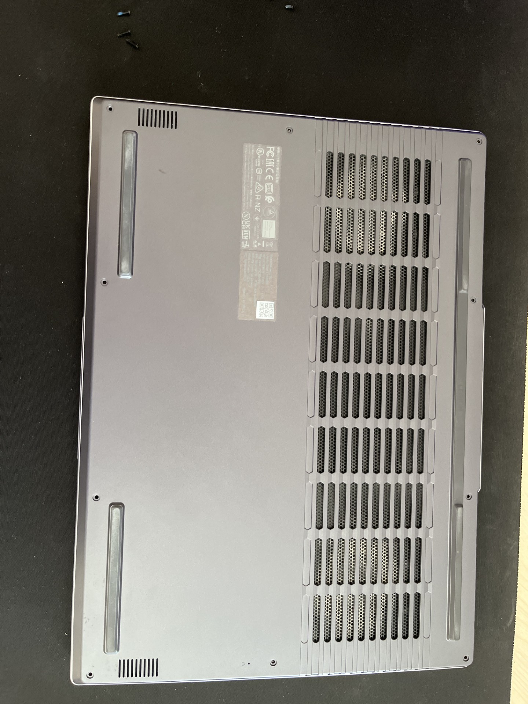

# 📘 Přidání SSD disku do notebooku

V této části popisuju, jak jsem do svého notebooku přidal nový SSD disk. Postup může být u každého notebooku trochu jiný, ale základní kroky jsou většinou stejné.

---

## 🔧 1. Otevření notebooku
Nejdřív jsem notebook vypnul a odpojil od nabíječky. Potom jsem odšrouboval všechny šroubky na spodní straně. Některé notebooky mají ještě západky nebo skryté šroubky pod gumovými nožičkami.

<figure>
  
  <figcaption align="center"><i>popis</i></figcaption>
</figure>

Když byly všechny šroubky venku, opatrně jsem sundal spodní kryt (pomocí plastové karty, aby se nic nepoškrábalo). Po otevření jsem našel volný slot pro SSD disk.

---

## 💽 2. Vložení SSD disku
V mém notebooku je slot typu **M.2**, což je úzký konektor pro moderní SSD disky.  
SSD disk má na jedné straně výřez, takže jde zasunout jen jedním směrem.

<figure>
  
  <figcaption align="center"><i>popis</i></figcaption>
</figure>

**Postup:**
1. SSD jsem zasunul do konektoru pod úhlem asi 30°.
2. Jemně jsem ho přitlačil dolů.
3. Přišrouboval jsem ho malým šroubkem, aby držel.

<figure>
  
  <figcaption align="center"><i>popis</i></figcaption>
</figure>

---

## 🔧 3. Zavření notebooku
Po přidání SSD jsem dal spodní kryt zpátky a dotáhl všechny šroubky. Notebook jsem potom normálně zapnul.

---

## 🧹 4. Formátování SSD disku
Po přidání nového disku ho Windows ještě nevidí jako „připravený“, takže se musí naformátovat.

### **Postup ve Windows:**
1. Pravým klikem na **Tento počítač** → **Spravovat**  
2. Vlevo **Správa disků**  
3. Nový disk se objeví jako „Nezařazený“  
4. Pravým klikem → **Inicializovat disk** (doporučeno: **GPT**)  
5. Vytvořit **Nový jednoduchý svazek**  
6. Přiřadit písmeno jednotky  
7. Formátovat jako **NTFS** → **Rychlé formátování**

Po dokončení se nový SSD normálně objeví v Tento počítač.

---

## 🎮 5. Přesunutí her na SSD (např. Steam)
Po instalaci SSD jsem přesunul některé hry, aby fungovaly rychleji.

**Postup ve Steamu:**
1. Steam → **Nastavení** → **Stažené soubory**  
2. **Knihovny Steam** → přidat novou složku na SSD  
3. U hry: **Vlastnosti** → **Instalované soubory**  
4. **Přesunout složku** → vybrat nový SSD

Tím se hra přesune na nový disk a bude startovat i načítat rychleji.

---

## ✔️ Závěr
Přidání SSD disku do notebooku není těžké, jen je dobré být opatrný, dávat pozor na šroubky a vždy pracovat bez napájení. Instalace i formátování ve Windows proběhly bez problémů.

